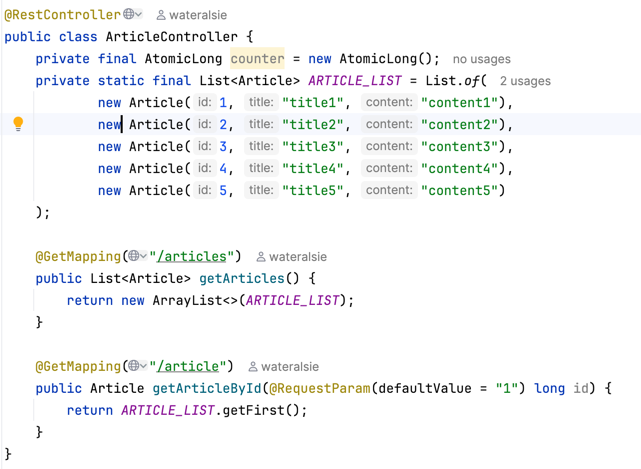

# 2025/11/18 중간 회고

백엔드는 완전히 처음이었던 사람으로서 먼저 스프링 튜토리얼을 따라하면서 스프링 프로젝트 생성부터 기본 구현 방법을 익혔습니다. 
https://spring.io/guides/gs/rest-service 이 가이드를 보면서 블로그 글 리스트 조회 api와 상세 조회 api를 다음과 같이 만들었습니다.

(제 첫 api 입니다 🥳)

작업하면서 그동안 안드로이드나 프론트엔드 개발하면서 사용했던 api의 구조를 자주 떠올리게 되더라고요.
어깨 너머로 보기만 했더라도 그 또한 경험이고, 크고 작은 경험 모두 소중한 자산이 된다는 점을 체감했던 것 같습니다.

다음은 구현하면서 고민을 많이 했던 부분입니다.

### 1. Query Parameter vs Path Variable
제가 본 api들은 보통 상세 조회할 글 id를 path variable의 형태로 받아 `article/1` 과 같은 url을 사용했습니다. query parameter와 path variable의 역할이 비슷해보였기에 차이점을 알아보았습니다.

* Path Variable
  * url 경로에 직접 포함하는 방식이므로, 리소스를 특정해야 할 때 사용하는 것이 일반적이라고 합니다.
  * 리소스를 특정하기 위해 필수로 필요한 요소를 Path Variable로 지정하면 좋을 것 같았습니다. 이는 주로 id와 같은 리소스의 고유 식별자가 될 수 있겠습니다.
* Query Parameter
  * url의 뒤에 `?`을 붙여, query string 형태로 정보를 제공하는 방식입니다.
  * query string이 없어도 url이 유효하기 때문에 정렬, 필터링 등 필수가 아닌 추가적인 옵션을 명시할 때 사용하는 것이 일반적이라고 합니다.

따라서 블로그 글 리스트 조회 url은 `/articles`로, 상세 조회 url은 `/articles/1`로 구현하였습니다.

### 2. 데이터베이스 연동
api를 처음 구현할 때 테스트하기 위해 임의로 controller 내부에 블로그 글 리스트를 만들어줬습니다.
이때 데이터베이스의 필요성을 느끼고 연동 작업을 해주었습니다. 
관계형 데이터베이스는 MySQL와 PostgreSQL이 대표적이나, 스프링 가이드에서는 [MySQL 연동 방법]("https://spring.io/guides/gs/accessing-data-mysql")만 다루었기 때문에 일단 MySQL로 구현을 시작하게 되었습니다.
추후 두 DB의 차이점과 장단점을 알아보고 다시 한번 DB를 고민해보겠습니다.

Spring Data JPA는 처음 써보는데, entity 클래스를 만듦으로써 테이블을 쉽게 관리할 수 있다는 점과 repository 인터페이스의 구현체를 만듦으로써 기본 CRUD 기능을 따로 구현하지 않아도 된다는 점에서 아주 유용했던 것 같습니다.

저는 가이드가 설명하는대로 `CrudRepository`를 사용했지만, `JpaRepository`가 더 많은 메서드를 지원하기에 한번 적용해보고 싶습니다.

---

현재는 유효한 케이스에 대한 기본적인 CRUD 기능을 구현 완료한 상태입니다.
* 블로그 글 게시
* 블로그 글 리스트 조회, 상세 조회
* 블로그 글 수정
* 블로그 글 삭제

다음으로는 예외 처리와 api가 전송하는 response 구조를 작업함으로써 CRUD 기능을 보강하려고 합니다.

오로지 제 힘으로 새로운 분야를 시작해보는 것은 처음이라서 (보통 학교나 기관의 힘을 받았던 것 같습니다!) 학습 속도가 더딜까봐 걱정되기도 했지만, 다른 분야 개발 경험이 있기에 해볼만하다는 생각이 들었었고, 실제로 쓸 블로그를 구현해본다고 생각하니 도전 의식이 생겼던 것 같습니다. 그리고 작업하면서 생긴 궁금한 점들을 해소하면서 구현하다보니 흥미롭기도 한 것 같습니다.